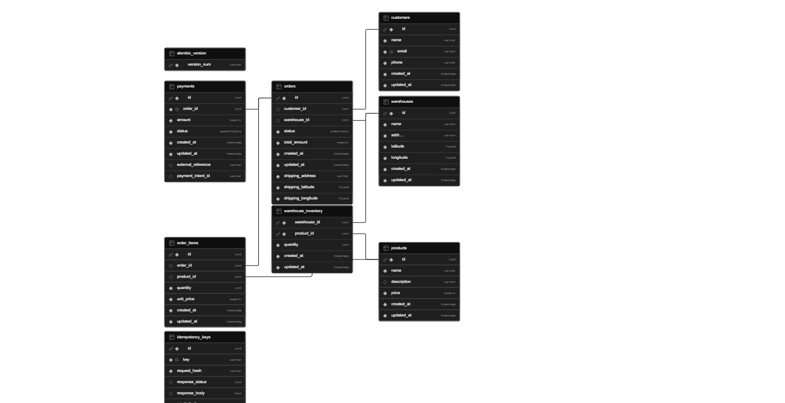

# Decision log — `POST /orders`

Why the create-order endpoint works the way it does. How to test it: [SEED_DATA.md](SEED_DATA.md).

## Mock geocoding

The assessment allowed skipping real geocoding APIs so we could focus on order logic.

We use a small in-memory geocoder: four demo addresses from the seed data map to coords near a warehouse; anything else gets stable fake coords from a hash of the address. That is enough to rank warehouses by distance. A real provider can plug into the same `geocode()` interface later.

## Mock payments

Same idea for payments — no Stripe/PCI in scope, but we still model create-then-confirm like PaymentIntents.

Payment runs in memory. Create is idempotent; confirm fails only if the card ends in `0000` (402). We do not store card numbers, only `payment_intent_id` after success.

## Row locking

Concurrent orders on the same SKU at the same warehouse could oversell stock if two requests read quantity and both decrement.

Before changing stock we run `SELECT … FOR UPDATE` on the relevant `warehouse_inventory` rows (`with_for_update()` in `inventory_repository.py`). We lock products in a fixed order to avoid deadlocks on multi-item orders.

Reserve happens inside a savepoint when we try a warehouse. If stock is not enough after the lock, we roll back and try the next nearest warehouse. If payment fails, we lock again, put stock back, and mark the order failed.

We also lock the order and payment rows after payment (confirm or compensate) and the idempotency row when we cache the final response — so retries do not double-confirm or write conflicting cached bodies.

Warehouse search itself is not locked. Two orders can both think a warehouse has stock; the loser finds out at reserve time and either tries another warehouse or gets 422.

## Commit inventory before paying

We commit the reservation and create the order in `AWAITING_PAYMENT`, then close the DB session before calling payment. We should not hold row locks or a connection open while waiting on Stripe (or the mock).

If payment fails, a new session releases stock and marks the order failed. If it succeeds, a new session marks it confirmed.

## Nearest warehouse, with fallback

We list warehouses that can fulfill the full cart, sort by distance, and try the closest first. Each try is a savepoint: reserve + pending order together. Lost races move to the next warehouse instead of failing immediately.

## Idempotency

`POST /orders` requires an `Idempotency-Key`. Same key + same body replays the stored 201 or 402. Same key + different body, or a request still in flight, returns 409.

## Database

Put your ER diagram here: **`docs/er-diagram.png`**

Main tables: `customers`, `orders`, `order_items`, `payments`, `products`, `warehouses`, `warehouse_inventory`, `idempotency_keys`. Order goes `AWAITING_PAYMENT` → `CONFIRMED` or `FAILED`.
